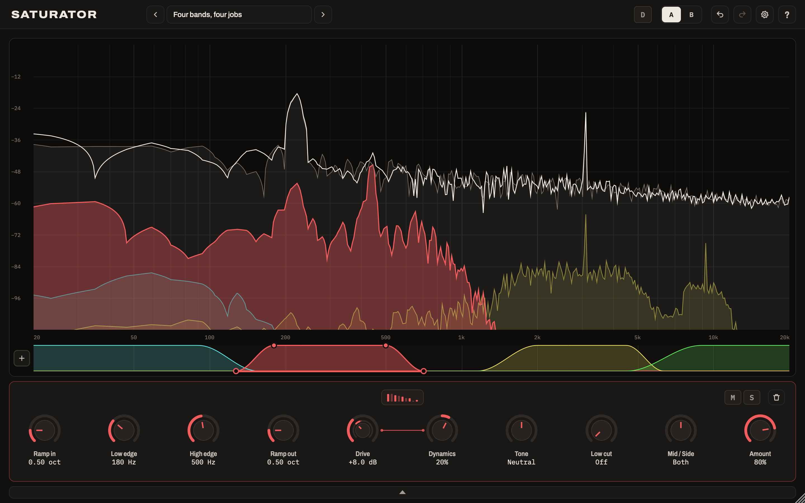

# Saturator

Saturator is a multiband saturation plugin. It splits the spectrum into up to six bands
and saturates each on its own, with its own model, drive and tone. The analyser draws what
each band's saturation adds in that band's colour, wherever it lands: harmonics above the
band, and the difference tones that several notes together make below it.

This repository is where Saturator releases are published. **[Download the latest
release](../../releases/latest).**

## What it does

- **Up to six bands.** Drag across the analyser to draw a band, or click **+** beside the
  band map. New bands fill the spectrum in order, split at 100 Hz, 300 Hz, 1 kHz, 3 kHz and
  8 kHz, each fading over an octave into its neighbours. Drag a band on the map to move it,
  and its handles to shape it.
- **Ten saturation models:** Clean Tube, Warm Tube, Tape, Transformer, Diode, Soft Clip,
  Hard Clip, Wavefold, Rectify and Bitcrush. Each is shown by the harmonics it adds.
- **Per band:** Drive; Dynamics, which pushes the drive up (or pulls it down) as the band
  gets louder; Tone, darker or brighter; a low cut on the saturation, from 6 dB/oct to a
  brick wall; a mid/side balance; and Amount.
- **M** mutes a band's saturation, **S** solos the band, and **D** plays only what
  Saturator changes.
- **Oversampling** from 1x to 32x, set separately for playing and for offline bounces, with
  an estimate of any aliasing and the rate that would clear it.

## Requirements

- macOS 11 or later, on Apple silicon or Intel.
- A host that loads Audio Units or VST3 plugins: Logic Pro, Ableton Live, Cubase, Reaper,
  Bitwig Studio, Studio One and others.

## Installing

Download the `.pkg` from the latest release and open it. It installs Saturator for all
users:

- the Audio Unit in `/Library/Audio/Plug-Ins/Components`;
- the VST3 in `/Library/Audio/Plug-Ins/VST3`.

You can leave either format out: choose **Customize** in the installer. The installer is
signed with a Developer ID and notarised by Apple.

## Getting started

1. Insert Saturator on a track or bus. It starts with no bands, passing the audio through
   untouched.
2. Click **+**, or drag across the analyser where you want a band.
3. Click the harmonics thumbnail to choose a model, and turn up **Drive**.
4. Press **S** to hear the band on its own, or **D** to hear only what Saturator adds.

Turn on help with the **?** in the header, then point at anything to see what it does.

## Trial and licence

Without a licence, Saturator is fully working, but plays a short reminder beep every 30
seconds. To activate, enter the email address your licence was issued to and your licence
token in the panel that opens with the plugin, or later from the cog in the header.
Activation happens offline and covers every Saturator instance on that Mac user account.

## Uninstalling

Delete `Saturator.component` from `/Library/Audio/Plug-Ins/Components` and
`Saturator.vst3` from `/Library/Audio/Plug-Ins/VST3`.

---

© Mark Hammond. All rights reserved.
